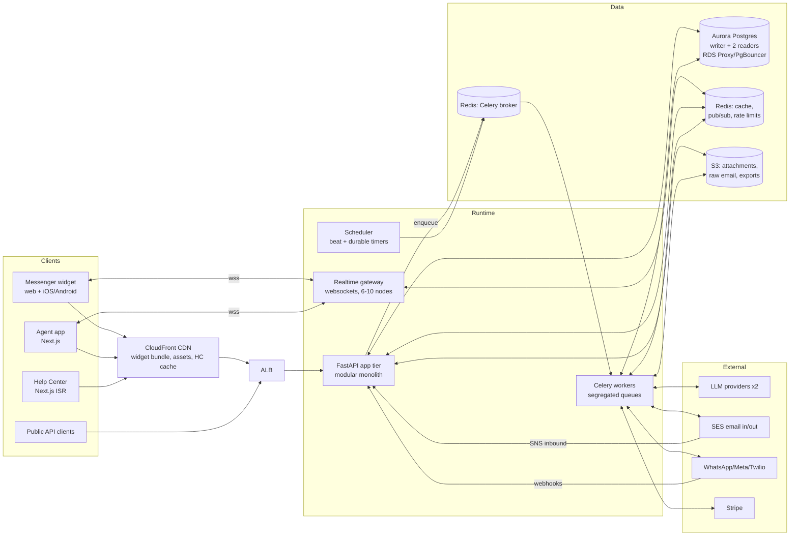
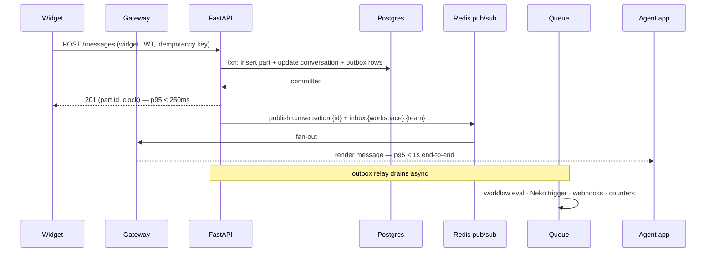

# Relay — System Architecture (RFC-001)

_Status: Draft · Author: Architecture WG · Date: 2026-07-22_
_One-line summary: A modular FastAPI monolith + segregated Celery worker tier + dedicated realtime gateway + Next.js frontends over one pooled Postgres, sized for 5k workspaces / 50M messages/mo / 500k concurrent Messenger connections, with named 10× levers._

Companion docs: RFC-000 (scope & sizing), RFC-002 (data layer, authoritative for schema), RFC-003 (AI subsystem).

## 1. Context & problem

Relay (RFC-000 §2) is, structurally, five workloads wearing one product:

1. **Interactive messaging** — low-latency, fan-out-heavy, business-hours-bursty (Messenger ↔ Inbox).
2. **Massive cheap connections** — hundreds of thousands of mostly-idle websockets on end-customer sites.
3. **Bulk async pipelines** — email/campaign sends, channel ingestion, webhook fan-out, media processing.
4. **AI inference chains** — slow (seconds), expensive, rate-limited, failure-prone external LLM calls.
5. **Analytics-ish querying** — event ingestion at 10× message volume, rollups, report queries.

The architecture's job is to keep workload 1 fast while workloads 2–5 flex, fail, and burst independently — on infrastructure a ≈10-engineer team can operate.

## 2. Goals / non-goals

**Goals:** meet the RFC-000 §4 envelope with headroom ≥2× on the interactive path; p95 targets in §3; every subsystem degradable (AI down ⇒ humans still work; realtime down ⇒ polling still works); zero-downtime deploys; single-region simplicity with a written 10× plan per bottleneck.

**Non-goals:** microservices decomposition (a modular monolith is deliberate — see §6.1); multi-region active-active; Kafka/event-sourcing platform (queues + outbox suffice at this envelope; named as a 10× lever); building our own email MTA, SMS gateway, or voice media stack (SES/Twilio).

## 3. Requirements & constraints

**Functional:** everything in RFC-000 §2.

**Non-functional (SLOs):**

| Path | Target |
|---|---|
| API availability | 99.9% monthly (error budget ≈ 43 min/mo) |
| Message send: persist + ack | p95 < 250 ms |
| Message fan-out: sender → recipient render | p95 < 1 s |
| Inbox view load (50 conversations) | p95 < 300 ms |
| AI agent first streamed token | p95 < 3 s |
| Campaign throughput | ≥ 200 emails/s sustained, burst 1,000/s |
| Webhook delivery | p95 < 30 s from event, at-least-once |
| Durability | RPO ≤ 5 min, RTO ≤ 1 h (RFC-002 §9) |

**Constraints:** stack mandated (FastAPI/Python 3.12+, Next.js/React, PostgreSQL 16+); team ops maturity = small (managed services over self-run infra); budget envelope RFC-000 §6; compliance target SOC 2 → GDPR (EU cell phase 3).

## 4. Assumptions

- A1. Business-hours concentration: ≈70% of daily traffic in an 8-hour window; peak ≈ 3× in-window average. **Sensitive** — if tenants skew global/consumer, peaks flatten (helps us).
- A2. Median message body ≤ 2 KB; attachments (≈10% of messages, avg 200 KB) go to object storage, never the DB.
- A3. Widget connections are ≈95% idle (no active conversation); they exist for presence + proactive delivery.
- A4. LLM providers (2+ vendors) offer streaming APIs with ≈1–2 s first-token latency and per-minute rate limits we must pool across tenants. **Sensitive** — RFC-003 owns mitigation.
- A5. One AWS region (us-east-1 or us-west-2) until the EU cell.
- A6. Tenants are cooperative but not trusted: any tenant may 100× its own load (imports, bot loops) — per-tenant limits are mandatory, day one.

## 5. Capacity estimates (the arithmetic)

### 5.1 Interactive messaging
- 50M msgs/mo → 1.67M/day; ×70% in 8h → 40/s in-window average; ×3 peak ⇒ **≈120 msg/s peak writes**.
- Each message triggers: 1 insert + 1 conversation update (same txn), ≈2 Redis publishes, 1–3 queue enqueues (workflow eval, AI trigger, webhooks), counter updates ⇒ ≈10–15 downstream ops ⇒ **≈1.5–2k ops/s peak** system-wide. Comfortable for one well-tuned Postgres primary + Redis; the DB write path is nowhere near disk limits (RFC-002 §3 shows ≈5–8 MB/s sustained WAL at peak).
- Inbox reads dominate: ≈5k concurrent agents × a view refresh/action every ≈10 s ⇒ ≈500 read QPS steady, plus contact panels, search. **Reads : writes ≈ 10:1 on the interactive path** ⇒ replicas + caching are the levers, not write sharding.

### 5.2 Realtime connections
- 500k concurrent websockets, ≈95% idle. Memory ≈ 20–50 KB/conn ⇒ 10–25 GB fleet-wide ⇒ 6–10 gateway nodes (4 GB each) with headroom. Reconnect storm after a deploy/outage: 500k conns re-establishing over 60 s = 8.3k handshakes/s — **this, not steady state, sizes the tier** (jittered backoff spreads it; §9).
- Fan-out is cheap per message (a conversation has ≤ a few subscribers: visitor + 1–3 agents + inbox-view watchers). The hot fan-out is *inbox views* (one team's "Open" view updates on every new conversation) — bounded per-workspace, cached counts.

### 5.3 Events & reporting
- 500M events/mo ≈ 190/s average, ≈600/s peak, batched via COPY in 1k-row chunks ⇒ trivial insert load, **but** raw row volume (6B rows/yr) makes this the first thing to outgrow Postgres. Mitigation: monthly partitions + rollups now; ClickHouse graduation trigger defined in §8.

### 5.4 Bulk pipelines & cost
- Email 20M/mo: SES ≈ $2k/mo; sustained 8/s, burst 1k/s from campaign fires ⇒ queue-absorbed.
- Webhooks: ≈1 delivery per 2 messages avg ⇒ ≈60/s peak + retries.
- Infra bill at envelope (monthly, ±30%): Fargate app+workers ≈$2.5k · Aurora Postgres (writer + 2 readers) ≈$2.5–4k · ElastiCache ×2 ≈$600 · gateway nodes ≈$500 · SES ≈$2k · CloudFront+S3 ≈$800 · NAT/misc ≈$500 ⇒ **≈$9–11k/mo** before LLM inference (RFC-003 §9 for that swing cost). Early-phase (<50 tenants) footprint: single-AZ small instances, **<$1.5k/mo**.

**What gets hot first, in order:** (1) Postgres *connections* (not CPU) — hence mandatory pooling; (2) inbox read queries on the conversations table — hence index discipline + replica routing; (3) the events table's raw volume — hence partitions/rollups and the ClickHouse trigger; (4) LLM provider rate limits — hence queueing + multi-provider pools.

## 6. Proposed architecture

### 6.1 Topology

**A modular monolith, not microservices.** One FastAPI codebase, strict internal module boundaries (§6.3), deployed as **four differently-scaled runtime shapes**. Every split below is justified by a real force (scaling profile, fault isolation, deploy cadence); nothing is split for fashion. A 10-engineer team gets one repo, one schema, one deploy pipeline — and fault isolation where it pays.

**Runtime shapes and why they're separate:**

| Unit | Workload | Force justifying the split |
|---|---|---|
| `app` (FastAPI, Uvicorn workers ≈ cores, 3–8 tasks) | All HTTP: public API, agent app BFF, widget API, channel webhooks | The interactive core; scaled on request latency |
| `gateway` (websockets) | 500k idle-ish connections, pub/sub fan-out | Memory-bound + connection-bound, nothing like `app`'s profile; a gateway OOM must not take the API down. **Build-vs-buy: default = Centrifugo** (proven OSS websocket server, Redis engine, per-channel auth via JWT/subscription tokens); fallback = thin asyncio/uvloop gateway if we need custom protocol semantics. Buying removes our riskiest custom infra. |
| `workers` (Celery, per-queue pools) | Everything async (§6.4) | Bursty/slow work must never starve interactive requests; per-queue isolation is the bulkhead |
| `web` (Next.js on Vercel) | Agent app shell (CSR behind auth), marketing (SSG), help centers (ISR, multi-tenant custom domains) | Different deploy cadence + Vercel's CDN/ISR grain; zero SSR on hot app paths |

The AI orchestrator (RFC-003) runs **inside the worker tier** on dedicated queues (`ai.interactive`, `ai.batch`) — same codebase, isolated pools. It becomes a separate service only if/when its deploy cadence or GPU-adjacent needs diverge (10× lever, §8).

### 6.2 Module map (one codebase, enforced boundaries)

`identity` (workspaces, seats, authn/z) · `crm` (contacts, companies, events, segments) · `messaging` (conversations, parts, inbox ops) · `channels` (email, WhatsApp/Meta, SMS, voice adapters) · `tickets` · `knowledge` (help center, sources, chunks) · `ai` (agent, copilot, retrieval — RFC-003) · `automation` (workflows, timers) · `outbound` (campaigns, series, sends) · `reporting` (metrics, rollups, custom reports) · `platform` (public API, webhooks, apps) · `billing`.

Rules: modules communicate via in-process service interfaces or **domain events on the outbox** (§6.5) — never by reaching into another module's tables. Import-linter enforces the graph in CI. This is what keeps the monolith splittable along these exact seams later.

### 6.3 Critical flow 1 — visitor message → agent screens (the product's heartbeat)

Unhappy paths: idempotency key dedupes client retries (RFC-002 §7); if Redis publish fails post-commit, the outbox relay re-publishes (at-least-once, subscribers dedupe by part id); if the gateway is down, widget + agent app fall back to 10 s polling against `app` (feature-flagged kill switch) — degraded, not dead.

### 6.4 Worker queues (bulkheads, explicitly)

| Queue | Work | Why isolated |
|---|---|---|
| `interactive` | workflow eval, assignment, counters | Low-latency budget; small fast tasks only |
| `ai.interactive` | Neko turns, copilot | Slow (seconds), rate-limited; concurrency-capped per provider **and per workspace** |
| `ingest` | inbound email parse, channel webhooks normalize | Burst-absorbing; poison-message-prone (malformed MIME) |
| `send.email` / `send.channels` | campaign + reply delivery | Provider rate-limited; huge bursts on campaign fire |
| `webhooks` | outbound webhook delivery + retries | Slow consumers must not clog anything else |
| `analytics` | rollups, segment refresh, metrics | Throughput over latency; can lag minutes safely |
| `housekeeping` | retention, archival, re-embeds, exports | Off-peak scheduled |

At-least-once everywhere ⇒ **every task idempotent** (natural keys or dedupe ledger). DLQ + max-retries on all queues; queue-depth and oldest-message-age alerts (the earliest under-provisioning signal). Redis broker (AOF-enabled) is acceptable because the **transactional outbox** (§6.5) makes critical enqueues re-derivable from Postgres; SQS is the drop-in upgrade if task-loss tolerance tightens.

### 6.5 Consistency spine: transactional outbox + idempotency

Any state change that must reliably cause downstream effects (fan-out, webhooks, workflow triggers, AI turns, billing meters) writes a row to `outbox` **in the same transaction** as the domain write. A relay (LISTEN/NOTIFY-woken, poll-backed) publishes to Redis/queues, marking rows done. Consumers are idempotent; delivery is at-least-once; ordering is per-aggregate via `(aggregate_id, seq)`. This one pattern is what lets us run a cheap broker, survive Redis loss, and later swap in Kafka **without touching producers**.

### 6.6 Channels (adapters normalize, core stays channel-agnostic)

- **Email in:** SES receive → S3 (raw MIME) → SNS → `ingest`: parse, thread (In-Reply-To/References + plus-addressed reply tokens), dedupe on Message-ID, attach or create conversation. **Out:** per-workspace domains (DKIM/SPF/DMARC guidance), SES configuration sets → bounce/complaint SNS → suppression list (hard bounce = permanent, tenant-visible).
- **WhatsApp/Meta/Instagram:** Meta webhooks → verify signature → normalize to a `ChannelMessage` envelope → same pipeline as §6.3. Per-tenant tokens in Secrets Manager; per-app rate budgets with token-bucket guards.
- **SMS/Voice:** Twilio; voice (phase 3) = media-stream service colocated with gateway tier, speech loop per RFC-003 §7.
- **API channel:** the public API is the adapter.

One envelope in, one conversation model out — channel quirks die at the adapter boundary.

### 6.7 Outbound/Series, workflows, webhooks — the async engines

- **Series/campaign fire:** audience snapshot (segment SQL, replica) → chunked enqueue (1k contacts/task) → per-tenant + global send-rate token buckets → provider send → delivery events (SES/Twilio webhooks) → `message_events` (partitioned) → rollups. Uniqueness on `(campaign_id, contact_id)` makes re-fires safe.
- **Workflow engine:** versioned graph (JSONB, RFC-002); each run advances via the step ledger (`workflow_run_steps` unique on `(run_id, step_id, attempt_scope)`) so replays never double-execute side effects. **Waits** are durable rows in `timers`, claimed by beat with `FOR UPDATE SKIP LOCKED` — survives broker loss, no in-memory sleep.
- **Webhook delivery:** signed (HMAC, timestamped), 429/5xx → exponential backoff + jitter up to 72 h, per-endpoint circuit breaker, auto-disable after sustained failure (tenant notified), 30-day delivery log.

## 7. Data model & storage (summary — RFC-002 is authoritative)

Single Aurora Postgres cluster: writer + 2 readers (one app-read, one analytics/exports). Shared-schema multi-tenancy: `workspace_id` on every row + RLS backstop; UUIDv7 keys; `conversation_parts`, `events`, `sends`, `message_events`, `webhook_deliveries`, `audit_logs` partitioned monthly; pgvector (HNSW) + Postgres FTS serve retrieval and search at this envelope; Redis is cache/coordination only — never a source of truth. Read-your-writes: inbox mutations read the writer; list views may read replicas with ≤1 s lag budget; per-session "recently wrote" pin to writer for 5 s.

## 8. Scaling strategy — what breaks first at 10× (500M msgs/mo, 25k workspaces)

| # | First to break | Signal to act | The lever (in cheapness order) |
|---|---|---|---|
| 1 | Events volume (6B → 60B rows/yr) | rollup lag; partition maintenance pain; report p95 > 5 s | Stop raw-event SQL: **ClickHouse** for events + report datasets, fed from outbox stream; Postgres keeps 90-day operational window. Trigger: >1.5B events/mo sustained. |
| 2 | Postgres write ceiling on messaging | writer > 60% CPU sustained; WAL > 30 MB/s; vacuum lag | Vertical first (Aurora scales far); then **split `messaging`+`crm` bounded contexts to their own cluster** (module boundaries make this a connection-string change + dual-write cutover); true sharding (Citus by `workspace_id`) only past that. |
| 3 | Gateway fleet | >1M conns; reconnect storms breach SLO | Horizontal (stateless-ish, Redis-engine); regional gateway PoPs; connection-establish rate limiting. |
| 4 | Inbox query latency | p95 > 300 ms with warm cache | Replica fan-out per workload; materialized per-view counts; then CQRS read models for inbox lists (outbox-fed projections). |
| 5 | FTS on conversations | search p95 > 1 s or index bloat dominating | **OpenSearch** fed from outbox; Postgres keeps transactional search for recent-90-days fallback. |
| 6 | LLM rate limits/cost | provider 429s; queue age > 30 s | Multi-provider pools, per-tenant token budgets, semantic cache, model tiering (RFC-003). |
| 7 | Celery/Redis broker throughput | broker CPU / task latency jitter | Queue-per-pool Redis instances; then SQS/Kafka for the fat pipes (outbox makes this a consumer swap). |

Dimensions of scale we are *not* solving now (named per skill discipline): geographies (EU is a **cell**, phase 3 — full second stack, no cross-region data plane) and org/team scale (module boundaries are the future service seams).

## 9. Failure modes & resilience

Timeouts on every network call; retries = bounded + jittered + idempotent-only; circuit breakers on all external providers; bulkheads via queue/pool isolation (§6.4). The big table:

| Component | Failure | Blast radius | Mitigation / degradation |
|---|---|---|---|
| LLM provider | Slow / down / 429 storm | Neko stalls | Per-provider breaker → secondary provider → graceful "routing you to the team" + auto-assign to humans; copilot hides; **humans unaffected** |
| Redis (pub/sub) | Down | No realtime push | Clients auto-fallback to polling (flagged); messages persist fine; outbox re-publishes on recovery |
| Redis (broker) | Down / data loss | Async work halts | API keeps accepting (outbox buffers); relay replays into fresh broker; idempotency absorbs duplicates |
| Postgres writer | Failover (≈30 s Aurora) | Writes fail briefly | Client retry w/ backoff + idempotency keys; RDS Proxy pins/reconnects; degraded read-only banner in agent app |
| Gateway node | OOM / crash | ≈50–80k conns drop | Jittered reconnect (spread over 60 s); sticky-less design (any node serves any conn); overload ⇒ shed *new* conns first |
| SES | Bounce storm / throttle | Campaign + replies delayed | Token buckets already cap; suppression list halts repeat offenders; per-tenant send pause switch |
| Meta/Twilio APIs | Rate limit / outage | Channel-specific delay | Per-channel queues isolate; user-visible channel status page per workspace |
| A tenant | 100× self-inflicted load (import loop, bot storm) | Noisy neighbor | Per-workspace rate limits (API, sends, AI turns), per-tenant worker concurrency caps, fair-share dequeue; abuse kill switch |
| Webhook consumer | Hangs/slow | Webhook queue growth | 10 s delivery timeout, breaker per endpoint, DLQ + auto-disable |
| Deploy | Bad release | Anything | Canary + auto-rollback on golden-signal regression (§13); schema always expand/contract so rollback is code-only |
| Widget bundle | Bad JS shipped to millions of pages | Customer sites | Versioned immutable bundles, staged rollout by workspace cohort, instant CDN rollback pointer |

Production-readiness posture: golden signals on every unit; structured logs with request/workspace correlation IDs; symptom-based alerts (SLO burn), not CPU alerts; queue depth + oldest-age alarms; runbooks per alert; quarterly restore + rollback drills. Load test the §5 numbers (k6: message path; artillery: 2× connection storm) before each phase gate.

## 10. Security & compliance

- **Tenant isolation:** every query workspace-scoped in the app layer **and** Postgres RLS as backstop (`SET LOCAL app.workspace_id`; policies on every tenant table — RFC-002 §7). Cross-tenant tests in CI as a release gate.
- **End-user identity:** widget sessions are signed JWTs; **identity verification** = per-workspace secret HMAC of the external user id (blocks impersonation of known users); unverified visitors get cookie-scoped leads only.
- **Agent authn/z:** short-lived access JWT + rotating refresh; SAML/OIDC SSO (phase 2); RBAC (owner/admin/agent/restricted + per-team), permission checks in the service layer (single choke point); full audit log (append-only, partitioned).
- **Platform:** API keys scoped + hashed at rest; OAuth apps with granular scopes; webhook HMAC signatures + replay-window timestamps; strict egress: app-defined Actions (RFC-003) run through an SSRF-guarded HTTP proxy (deny RFC-1918, resolve-then-connect pinning).
- **Data:** TLS everywhere; KMS at rest (RDS, S3, Redis); attachments on presigned URLs with content-disposition + AV scan (ClamAV worker); PII minimization in logs (scrubbing middleware); per-tenant crypto-shredding path for GDPR delete (RFC-002 §10); secrets in AWS Secrets Manager, never env-baked.
- **Abuse:** per-IP + per-workspace rate limits at ALB/app; spam classifier on inbound (phase 2); block/suppress lists.
- **Compliance runway:** SOC 2 Type I by phase 1 exit, Type II by phase 3; GDPR DPA + EU cell phase 3; pen test before GA.

## 11. Alternatives considered

1. **Microservices from day one** (conversation-svc, contact-svc, …). Rejected: at 120 msg/s peak nothing needs independent scaling that the four runtime shapes don't already give; the cost (distributed transactions, contract churn, N pipelines, on-call surface) lands on a 6-person team immediately, the benefit lands never. The module map + outbox gives us the seams for free.
2. **Elixir/Phoenix for the whole core** (channels/presence are genuinely superb for workload 2). Rejected on team/stack constraint and AI-ecosystem gravity in Python; we capture 80% of the benefit by *buying* the connection tier (Centrifugo) instead.
3. **Kafka as the event backbone now.** Rejected: outbox + Redis/SQS covers the delivery semantics at this envelope with a fraction of the ops load; the outbox is deliberately Kafka-shaped so graduation is a consumer swap (§8 #7).
4. **DynamoDB for messages** (classic chat-at-scale answer). Rejected: our access patterns are relational and multi-index (inbox views, SLA queries, reporting joins, cross-channel threads); at 120 msg/s Postgres partitioning is nowhere near stressed, and we keep transactions + one engine (full analysis RFC-002 §11).
5. **Vercel serverless for the API tier.** Rejected for the API (connection explosion against Postgres, no long-lived processes, LLM streaming limits); kept for `web` where its grain (ISR/CDN/previews) is exactly right.

## 12. Risks & open questions

| Risk / question | Owner | Mitigation / decision point |
|---|---|---|
| Centrifugo fit for per-conversation authz at our token model | Backend lead | Spike in phase 0; fallback asyncio gateway design already sketched |
| Aurora vs plain RDS + PgBouncer cost at small scale | Infra | Start RDS single-AZ in phase 0; move to Aurora at >500 GB or replica need |
| Redis-broker task-loss tolerance for `send.email` | Backend | If campaign audits show gaps: move send queues to SQS (interface already abstracted) |
| asyncpg + transaction-pooling prepared-statement trap | Backend | Decision recorded in RFC-002 §9 (disable statement cache / use RDS Proxy pinning consciously) |
| Vendor concentration (AWS+SES+Twilio+Meta+2 LLMs) | CTO | Accepted for velocity; abstraction layers at each adapter; revisit at phase 3 |
| EU cell operational model (2 full stacks) | Infra | Phase-3 design doc; until then EU prospects sign US hosting |

## 13. Rollout, CI/CD & migration plan

- **Pipeline (GitHub Actions):** PR → lint/typecheck (ruff, mypy, tsc) → unit tests → build **one immutable image** → integration tests against ephemeral Postgres/Redis (testcontainers) → security scan → push. Merge to main → auto-deploy staging (mirrors prod shape, synthetic load) → smoke suite → **canary to prod**: 5% of `app` tasks + 1 gateway node, 15 min golden-signal watch with deploy markers → full rolling. Auto-rollback = repoint to previous image (build-once makes this seconds).
- **Migrations:** Alembic, expand/contract only, `lock_timeout` + retry wrapper, `CREATE INDEX CONCURRENTLY`, batched backfills as `housekeeping` tasks — migration step runs before code deploy and must be compatible with **both** running versions (full discipline in RFC-002 §9).
- **Feature flags** (Unleash, self-hosted): every risky subsystem ships dark with a kill switch — realtime fallback-to-polling, Neko per-workspace enable, new channel adapters, series engine. Flags decouple deploy from release across the whole phased roadmap.
- **Environments:** dev (docker-compose, one command) → PR previews (Vercel for web; ephemeral API optional) → staging → prod. IaC: Terraform, applied via pipeline with plan review.
- **Phased delivery:** maps 1:1 to RFC-000 §5; each phase's exit gate includes its load test, chaos drill (kill Redis, kill a gateway node, LLM blackhole), and restore rehearsal.

---
_→ RFC-002 for the data layer this design stands on; RFC-003 for the AI subsystem._
