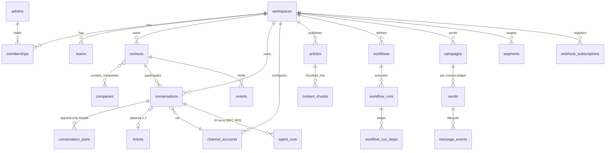

# Relay — Data Layer Design (RFC-002)

_Status: Draft · Author: Architecture WG · Date: 2026-07-22_
_One-line summary: One pooled PostgreSQL cluster holds the entire platform — shared-schema multi-tenancy with RLS backstop, UUIDv7 keys, monthly-partitioned high-volume tables, pgvector + FTS for retrieval — sized to 5k workspaces / 50M messages/mo with named graduation triggers._

Companion docs: RFC-000 (envelope), RFC-001 (topology; §6.5 outbox is referenced throughout), RFC-003 (consumes the retrieval schema).

## 1. Context & problem

This layer is the source of truth for ≈12 product domains (RFC-001 §6.2): identities, a 100M-row CRM, an append-heavy conversation store, knowledge content with embeddings, automation graphs with durable execution state, campaign send ledgers, metering for usage-billing, and an events firehose 10× everything else. One design must serve interactive point reads at p95 < 300 ms *and* absorb 6B rows/yr of analytics-ish appends — and be operable by a small team.

The stance (per the discipline): model from **access patterns, not nouns**; **one Postgres until a named force**; spend deliberation on the irreversible choices — engine, tenancy, keys, partition keys.

## 2. Access patterns (the foundation)

Read paths (R#) and write paths (W#) everything downstream is justified against:

| # | Path | Shape | Frequency (peak) | Latency budget | Consistency |
|---|---|---|---|---|---|
| R1 | Inbox view: open convos for team/assignee, ordered by waiting-since | Multi-predicate range scan, LIMIT 50 | ≈500 QPS | p95 < 100 ms (DB share) | Read-your-writes for the acting agent |
| R2 | Conversation thread: parts by conversation, newest page | Point + keyset range | ≈300 QPS | < 50 ms | Strong per conversation |
| R3 | Contact panel: profile + attrs + last N convos + recent events | 3–4 point/short-range reads | ≈200 QPS | < 100 ms | Replica-tolerant (≤1 s lag) |
| R4 | Unread/queue counts per view | Aggregate over R1 predicate | High | < 50 ms | Approximate OK (cached) |
| R5 | Segment evaluation (audience for targeting/series) | Set query over attrs + event rollups | Bursty (campaign fire) | Seconds OK | Snapshot |
| R6 | Article by slug (help center + widget) | Point read | High but ≈99% CDN/cache-absorbed | < 30 ms | Stale-OK (60 s) |
| R7 | AI retrieval: top-k hybrid (vector + FTS) chunks, workspace-scoped | HNSW ANN + GIN FTS, k≈20 | ≈50 QPS | < 300 ms | Stale-OK (minutes) |
| R8 | Search: conversations/contacts by text | FTS / trigram | ≈20 QPS | < 1 s | Stale-OK |
| R9 | Reports: rollup scans by workspace/day/team | Aggregates over pre-rolled tables | Low QPS, wide | < 3 s | Eventual (≤5 min) |
| R10 | Webhook/audit/run logs by parent, recent-first | Keyset range on partitioned tables | Low | < 1 s | Eventual |
| W1 | **Message append** + conversation head update + outbox | 3-row txn | **≈120 TPS** | < 50 ms commit | ACID (one txn) |
| W2 | Contact upsert (identify) | Upsert by (workspace, external_id/email) | ≈200 TPS bursts (imports) | < 50 ms | Idempotent |
| W3 | Event append | Batched COPY (1k rows) | ≈600 rows/s peak | Seconds OK | At-least-once, deduped downstream |
| W4 | Conversation state ops (assign/close/snooze/tags) | Single-row update + part append | ≈50 TPS | < 50 ms | ACID |
| W5 | Send ledger append + delivery-event append | Insert-heavy, unique-guarded | 1k/s bursts | Async | Idempotent on (campaign, contact) |
| W6 | Workflow step ledger + timers | Insert + claim (`SKIP LOCKED`) | ≈100 TPS | < 50 ms | Exactly-once *effects* via ledger |
| W7 | Chunk embed upserts (re-index) | Bulk upsert + HNSW maintenance | Batch, off-peak | Minutes | Eventual |
| W8 | Usage meters (AI resolutions, seats) | Append + monthly rollup | Low | Async | **Must not lose** (billing) |

Two deliberately *removed* hot writes: read-cursors and typing/presence live in **Redis** (flushed periodically / TTL-expired) — they'd be the highest-frequency, lowest-value UPDATE load in the system and would bloat `conversations` for nothing.

## 3. Workload & capacity estimates

At the RFC-000 envelope (24 mo):

| Table (domain) | Rows @ horizon | Row size | Volume (heap + idx) | Growth |
|---|---|---|---|---|
| `conversation_parts` | ≈600M (50M msg/mo × 12, incl. system parts) | ≈1.2 KB avg | **≈1.4 TB** | 60–100 GB/mo |
| `events` | ≈6B/yr | ≈250 B | **≈2.3 TB/yr** | 190 GB/mo — the volume problem |
| `contacts` | ≈100M | ≈1 KB + attrs | ≈180 GB | Import-bursty |
| `conversations` | ≈60M/yr | ≈600 B | ≈60 GB | Hot update surface |
| `sends` + `message_events` | ≈240M + ≈1B/yr | small | ≈350 GB | Campaign-bursty |
| `content_chunks` | ≈10M (5k tenants × ≈2k) | 1 KB + 6 KB vector (1536-d) | ≈90 GB incl. HNSW | Slow |
| Everything else | — | — | < 150 GB | — |

WAL at peak ≈ (120 W1 × ≈4 KB amplified) + batch loads ≈ **5–10 MB/s** — far from limits. Working set = last-90-days conversations + contacts hot slice + chunks ≈ **300–400 GB** ⇒ writer with 128–256 GB RAM keeps hit ratio > 99% (Aurora r7g.4xl class); this, not CPU, sizes the instance.

**Pressure ranking:** (1) connection slots under async app + serverless-ish web — pooling is mandatory; (2) `events` raw volume — partitions + rollups now, ClickHouse trigger at >1.5B/mo; (3) index bloat/vacuum on `conversations` (hot updates) — fillfactor + autovacuum tuning; (4) HNSW build cost on bulk re-embeds — off-peak, `maintenance_work_mem` sized.

## 4. Storage engine decision

**One PostgreSQL 16+ cluster (managed: RDS → Aurora as we grow), plus Redis for ephemera, plus S3 for blobs.** Postgres absorbs every named workload at this envelope: relational OLTP (obviously), JSONB for tenant-defined attributes and workflow/segment ASTs, **pgvector HNSW** for R7, **native FTS** for R8, **declarative partitioning** for the append firehoses, `SKIP LOCKED` queues for timers/relays. No second search or vector engine until the §8 triggers fire — every additional store is another thing to run, back up, secure, and keep consistent, and at 50 QPS retrieval / 20 QPS search that tax buys nothing.

Named forces that *would* change this (with their graduation paths pre-designed): events > 1.5B/mo → ClickHouse (fed from outbox); FTS p95 > 1 s at 10× → OpenSearch (fed from outbox); messaging write ceiling → bounded-context cluster split, then Citus. Source of truth remains Postgres in every case; derived stores are rebuildable.

## 5. Data model

### 5.1 Conventions (irreversible-ish — decided once)

- **Keys:** `uuid` **UUIDv7** PKs app-generated (time-ordered ⇒ index locality on write-heavy tables; safe to expose with public prefixes `cnv_`, `msg_`, `usr_` via base62). Exception: `events.id bigint identity` (never exposed, cheapest possible).
- **Tenancy:** every tenant-owned row carries `workspace_id uuid NOT NULL` + composite indexes lead with it + RLS (§7). Shared schema (pooled) — the tradeoff analysis is §11.1.
- Timestamps `timestamptz` (UTC); soft-delete only where product semantics need it (contacts, articles) via `deleted_at`; money/usage as `numeric`; enums as Postgres enums only for closed sets (conversation state), `text` + CHECK for evolving sets.
- Integrity lives **in the database**: FKs with explicit `ON DELETE`, `NOT NULL` by default, CHECK constraints on state machines.

### 5.2 ERD (core spine — ≈40 tables total; illustrative, not exhaustive)



### 5.3 The messaging core (hottest domain — full DDL sketch)

Intercom-style modeling: a conversation is a head row; **everything that happens is an append-only `conversation_part`** (message, note, assignment, state change, rating…). Tickets are a 1:1 extension of conversations, not a parallel system — one inbox, one thread model, one reporting spine.

```sql
CREATE TABLE conversations (
  id              uuid PRIMARY KEY,            -- UUIDv7
  workspace_id    uuid NOT NULL REFERENCES workspaces(id),
  contact_id      uuid NOT NULL REFERENCES contacts(id),
  channel         text NOT NULL,               -- chat|email|whatsapp|messenger_fb|instagram|sms|voice|api
  channel_account_id uuid REFERENCES channel_accounts(id),
  state           conversation_state NOT NULL DEFAULT 'open',  -- enum open|snoozed|closed
  assignee_id     uuid REFERENCES admins(id),
  team_id         uuid REFERENCES teams(id),
  priority        boolean NOT NULL DEFAULT false,
  waiting_since   timestamptz,                 -- null when not awaiting agent
  snoozed_until   timestamptz,
  last_part_at    timestamptz NOT NULL,
  first_contact_reply_at timestamptz,
  attributes      jsonb NOT NULL DEFAULT '{}', -- tenant-defined conversation attrs
  ai_status       text,                        -- null|active|resolved|handed_off
  created_at      timestamptz NOT NULL DEFAULT now(),
  CONSTRAINT snooze_shape CHECK (state <> 'snoozed' OR snoozed_until IS NOT NULL)
) WITH (fillfactor = 85);   -- HOT-update headroom: this row is updated on every part

-- R1 (the money query) — partial indexes per inbox axis:
CREATE INDEX conv_open_team  ON conversations (workspace_id, team_id, waiting_since ASC)
  WHERE state = 'open';
CREATE INDEX conv_open_asgn  ON conversations (workspace_id, assignee_id, waiting_since ASC)
  WHERE state = 'open';
CREATE INDEX conv_contact    ON conversations (workspace_id, contact_id, last_part_at DESC); -- R3
CREATE INDEX conv_snoozed    ON conversations (snoozed_until) WHERE state = 'snoozed';        -- wake scan

CREATE TABLE conversation_parts (
  id              uuid NOT NULL,               -- UUIDv7 (global order within conversation)
  workspace_id    uuid NOT NULL,
  conversation_id uuid NOT NULL,
  author_kind     text NOT NULL,               -- contact|admin|ai_agent|system
  author_id       uuid,
  part_type       text NOT NULL,               -- comment|note|assignment|state_change|rating|...
  body            text,                        -- normalized rich-text (blocks JSON serialized)
  body_tsv        tsvector GENERATED ALWAYS AS (to_tsvector('simple', coalesce(body,''))) STORED,
  attachments     jsonb NOT NULL DEFAULT '[]', -- S3 refs only, never bytes
  channel_meta    jsonb NOT NULL DEFAULT '{}', -- Message-ID, wa ids, etc.
  created_at      timestamptz NOT NULL DEFAULT now(),
  PRIMARY KEY (created_at, id)                 -- partition-key-leading PK
) PARTITION BY RANGE (created_at);             -- monthly partitions, pre-created +2 ahead

CREATE INDEX parts_thread ON conversation_parts (conversation_id, id);          -- R2 keyset
CREATE INDEX parts_fts    ON conversation_parts USING gin (body_tsv);           -- R8 (per partition)
-- Write amplification budget for W1: PK + 2 indexes ≈ 4 index writes/insert. Acceptable at 120 TPS.
```

W1 is one transaction: insert part → update conversation head (`last_part_at`, `waiting_since`, counters) → insert `outbox` row. No cross-table fan-out inside the txn; everything else is outbox-driven (RFC-001 §6.5).

**Partition lifecycle:** monthly; `housekeeping` pre-creates T+2 months (alerted if missing); partitions > 18 mo detached → exported to S3 Parquet (Athena-queryable for compliance/export) → dropped. Retention per plan/GDPR overridable per workspace via scrub jobs rather than partition drops (pooled tenancy tradeoff, §11.1).

### 5.4 CRM: contacts, attributes, events, segments

```sql
CREATE TABLE contacts (
  id           uuid PRIMARY KEY,
  workspace_id uuid NOT NULL,
  kind         text NOT NULL DEFAULT 'user',        -- user|lead
  external_id  text,                                 -- tenant's user id
  email        citext,
  phone        text,
  name         text,
  custom       jsonb NOT NULL DEFAULT '{}',          -- typed via attribute_definitions
  last_seen_at timestamptz,
  deleted_at   timestamptz,
  created_at   timestamptz NOT NULL DEFAULT now()
);
CREATE UNIQUE INDEX contacts_ext ON contacts (workspace_id, external_id) WHERE external_id IS NOT NULL AND deleted_at IS NULL;
CREATE UNIQUE INDEX contacts_email_user ON contacts (workspace_id, email) WHERE kind='user' AND email IS NOT NULL AND deleted_at IS NULL;
CREATE INDEX contacts_name_trgm ON contacts USING gin (workspace_id, name gin_trgm_ops); -- R8 typeahead (btree_gin)
CREATE INDEX contacts_custom ON contacts USING gin (custom jsonb_path_ops);      -- R5 attr predicates
```

> **P0.2 clarification — trigram typeahead under RLS.** `contacts_name_trgm` leads with
> `workspace_id` (via `btree_gin`), not a bare `gin(name)`, for two reasons: (1) it satisfies
> the §5.1 "composite indexes lead with `workspace_id`" convention; (2) under **forced RLS**
> `ILIKE`/`~~*` is *not leakproof*, so PostgreSQL will not use a bare `gin(name)` index for the
> match (it defers the non-leakproof qual to a post-security filter and falls back to a Seq
> Scan). The composite index is chosen because the leakproof `workspace_id` equality (the RLS
> policy qual) is a usable index cond, scoping to the tenant and eliminating the Seq Scan; the
> `ILIKE` is then a cheap filter over the tenant's contacts. Requires the `btree_gin` extension.

W2 upsert is `INSERT … ON CONFLICT (workspace_id, external_id) DO UPDATE` — naturally idempotent; merges (email↔external_id collisions) are explicit jobs writing a `contact_merges` audit row. `attribute_definitions` gives `custom` its types/validation (app-enforced, spot-audited by a nightly checker — the JSONB-swamp guard).

```sql
CREATE TABLE events (
  id           bigint GENERATED ALWAYS AS IDENTITY,
  workspace_id uuid NOT NULL,
  contact_id   uuid NOT NULL,
  name         text NOT NULL,
  properties   jsonb NOT NULL DEFAULT '{}',
  created_at   timestamptz NOT NULL,
  PRIMARY KEY (created_at, id)
) PARTITION BY RANGE (created_at);               -- monthly; BRIN instead of fat B-trees:
CREATE INDEX events_brin ON events USING brin (created_at);
CREATE INDEX events_contact ON events (workspace_id, contact_id, name, created_at); -- R3/R5 window queries
```

Loaded by COPY batches (W3). **P0.2 clarification — COPY under RLS:** PostgreSQL forbids
`COPY FROM` on an RLS-enabled table (`COPY FROM not supported with row-level security`), so the
`analytics` drain buffers events per-workspace in Redis and, per (workspace, chunk) in one
transaction, `SET LOCAL app.ws` → `CREATE TEMP TABLE … ON COMMIT DROP` → `COPY … FROM STDIN`
(temp tables have no RLS) → `INSERT INTO events SELECT …` through the parent (RLS `WITH CHECK`
enforces isolation on the write path too). RLS stays enabled+forced; no BYPASSRLS runtime role
is added. Monthly partitions are pre-created T+2 by `relay_ensure_partitions(parent, n)` —
a SECURITY DEFINER function owned by `migrator`, EXECUTE-granted to `app_rw` — called by the
`housekeeping` task (so app_rw never needs DDL); `relay_missing_partitions` drives the alert.
**Segments never scan raw events:** `event_rollups (workspace_id, contact_id, event_name, day, count)` (daily, upserted by `analytics` workers) + `contacts.custom` carry R5; a segment is a stored predicate AST (JSONB) compiled to SQL over `contacts` + rollups. Membership for messaging is snapshotted at send time (W5) — no drifting mid-campaign.

### 5.5 Knowledge & retrieval (feeds RFC-003)

`articles` (+ `article_translations`, versioned drafts) and `external_sources` (URLs, PDFs, synced third-party docs) both shred into:

```sql
CREATE TABLE content_chunks (
  id           uuid PRIMARY KEY,
  workspace_id uuid NOT NULL,
  source_kind  text NOT NULL,           -- article|pdf|url|snippet|custom_answer
  source_id    uuid NOT NULL,
  locale       text NOT NULL DEFAULT 'en',
  audience     jsonb NOT NULL DEFAULT '{}',   -- targeting filters
  content      text NOT NULL,
  tsv          tsvector GENERATED ALWAYS AS (to_tsvector('simple', content)) STORED,
  embedding    halfvec(1536),           -- pgvector half-precision: halves RAM, negligible recall loss
  emb_version  smallint NOT NULL,       -- re-embed migrations are dual-version cutovers
  updated_at   timestamptz NOT NULL DEFAULT now(),
  UNIQUE (source_kind, source_id, locale, emb_version, id)
);
CREATE INDEX chunks_hnsw ON content_chunks USING hnsw (embedding halfvec_cosine_ops)
  WITH (m = 16, ef_construction = 64);
CREATE INDEX chunks_fts  ON content_chunks USING gin (tsv);
CREATE INDEX chunks_ws   ON content_chunks (workspace_id, source_kind);
```

R7 gotcha, named: HNSW is a **global** index; per-workspace filtering post-filters the ANN result. With ≈5k tenants a top-k=20 query oversamples (`ef_search`≈100–200, iterative scan in pgvector ≥0.8) — measured fallback if a mega-tenant's recall degrades: partition `content_chunks` by hash(workspace_id) so each HNSW is smaller and tenant-denser. Hybrid ranking (vector + FTS, RRF-fused) runs as one SQL CTE; sketch in RFC-003 §4.

**P1.1 extension (implemented — `content_chunks` ingestion columns + three companion tables).** The DDL above is the retrieval *contract*; the ingestion pipeline (RFC-003 §3–4) added the columns it needs to diff and cite, and three small tenant tables. All ship with RLS enabled + FORCED (`create_tenant_table`) and a cross-tenant leakage test.

- `content_chunks` gains: `chunk_index smallint/int` (stable ordinal within `(source_kind, source_id, locale, emb_version)`), `content_hash text` (sha256 of `content` — so a re-sync re-embeds **only changed chunks**), `token_count int`, `heading_path text` + `title text` (heading breadcrumb + source title, for budgeting and citations). The practical upsert/diff key is `UNIQUE (workspace_id, source_kind, source_id, locale, emb_version, chunk_index)`; `embedding` is nullable (chunks are written first, embedded in a batch pass). The three indexes are built `CONCURRENTLY` (it is a LARGE_TABLE): `chunks_hnsw` (HNSW `halfvec_cosine_ops`, m=16 ef_construction=64), `chunks_fts` (GIN on `tsv`), `chunks_ws` (`workspace_id, source_kind`).
- `external_sources` — a synced source (`kind ∈ {url, pdf, snippet}`) with `status ∈ {pending, syncing, synced, error}` (the per-source **AI-readiness** surfaced in the UI), `config` JSONB (crawl url/sitemap, PDF s3 key, snippet body), `locale`, `audience`, `content_hash`, `document_count`/`chunk_count`, `last_synced_at`, `last_error`.
- `knowledge_settings` — one row per workspace holding the **active** `emb_version` (the atomic per-tenant cutover point of a re-embed: retrieval requires `emb_version = current`) and the default `ef_search`.
- `retrieval_evals` — the CI retrieval-regression ledger: one row per (corpus, method) with `recall_at_k`, `mrr`, `num_queries`, `emb_version`, `params`. The offline eval gate (RFC-003 §8) asserts hybrid recall@10 ≥ 0.85 and that hybrid beats vector-only and FTS-only on labelled synthetic corpora.

**P1.2 extension (implemented — the Neko orchestrator's storage; the ER diagram's `agent_runs`).** Two tenant tables (RLS enabled + FORCED via `create_tenant_table`, each with a cross-tenant leakage test):

- `agent_runs` — one row per Neko turn (RFC-003 §3), written **every** turn: `conversation_id`, `trigger_part_id`, `status` (pending→complete), `outcome` (`answered|clarify|handoff|ineligible|error`) + `handoff_reason`, preflight `language`/`safety_class`, `query`/`rewritten_query`, `retrieved` JSONB (chunk ids + scores), `grounding_score`, `prompt_hash`, `provider` + per-stage `models`, `answer`/`citations`, `verdict` JSONB, `tokens`/`cost_usd`/`latency_ms` accounting, and a fully replayable `trace` JSONB. **`UNIQUE (workspace_id, trigger_part_id)`** is the exactly-once gate against the at-least-once turn trigger (master rule 3) and the idempotency key; `ix_agent_runs (workspace_id, conversation_id)` serves the run inspector (P1.4). Not partitioned yet — a workspace emits a couple of turns per resolved conversation; it graduates to monthly partitioning like `events` if the envelope demands it.
- `ai_settings` — one row per workspace (`UNIQUE (workspace_id)`): the per-workspace Neko kill switch `enabled`, `channels` scope, the tunable `grounding_threshold` + `max_clarifications` gate (RFC-003 §5), source-kind scope, `persona`, and `answer_max_tokens`. The global kill switch (Neko on/off + model-route) lives in settings/Unleash, not here.

### 5.6 Automation, outbound, platform, billing (compressed)

- `workflows` / `workflow_versions` (graph JSONB; runs pin a version — editing never mutates in-flight runs), `workflow_runs`, `workflow_run_steps` (**unique `(run_id, step_id)` — the exactly-once-effects ledger**), `timers (fire_at, claimed_by)` with `(fire_at) WHERE claimed_by IS NULL` partial index, claimed via `FOR UPDATE SKIP LOCKED` (W6).
- `campaigns` / `campaign_versions` / `series` (graph JSONB) / `sends` (**UNIQUE `(campaign_id, contact_id)`** — re-fires safe; monthly partitions) / `message_events` (delivery lifecycle, monthly partitions, rolled into `campaign_stats`) / `subscription_types` + `consents` (per contact × type, audit-trailed).
- **Channels — email adapter (P0.7):** `verified_domains` (per-workspace sending domains; a GLOBAL partial-unique `(domain) WHERE status='verified'` makes inbound routing deterministic across tenants) / `channel_accounts` (inbound support address, globally unique; `conversations.channel_account_id` FK, added in the P0.7 expand migration) / `email_messages` (inbound+outbound ledger — **UNIQUE `(workspace_id, message_id)`** is the RFC-822 dedupe/threading key, **UNIQUE `(workspace_id, part_id)`** the outbound exactly-once gate) / `suppressions` (**UNIQUE `(workspace_id, email)`**; hard bounce/complaint/manual — sends blocked at the service layer) / `email_delivery_events` (delivery audit). Global infra (no RLS, like `outbox`): `channels_inbound_dedupe (sns_message_id)` — the primary pre-tenancy idempotency gate — and `channels_ingest_failures` (DLQ replay log). Pre-tenancy routing via SECURITY-DEFINER resolvers (`channels_resolve_inbound_address` / `channels_resolve_outbound_message` / `channels_resolve_account_workspace` / `channels_pending_domains`), mirroring `identity_admin_workspaces`. **Deviations:** (a) `email_delivery_events` is non-partitioned for P0.7's low volume — the partitioned campaign-scale `message_events` above stays with the outbound module (P1.8); (b) reply tokens are **stateless HMAC** plus-addresses (RFC-001 §6.6), so there is no `reply_tokens` table.
- **Mobile push (P1.10):** `device_tokens` (an iOS/Android SDK's APNs/FCM token for a contact; **UNIQUE `(workspace_id, token)`** so registration is a rotation-safe upsert; `status` flips `active`→`stale` on provider rejection; fan-out lookup index `(workspace_id, contact_id, status)`) / `push_receipts` (**UNIQUE `(workspace_id, message_id, device_token_id)`** — the per-(message, device) exactly-once gate for the at-least-once push fan-out; `message_id` is a plain uuid since `conversation_parts` is partitioned). Both RLS-forced. The fan-out is a `messaging` outbox consumer (`relay push-dispatch`) → `messaging.send_push` on the `send.channels` queue → APNs/FCM (RFC-000 §2.1).
- `webhook_subscriptions` / `webhook_deliveries` (partitioned, 30–90 d retention), `api_keys` (hashed), `oauth_apps`/`app_installs`, `audit_logs` (append-only, partitioned, no FK to allow actor deletion), `idempotency_keys (workspace_id, key, request_hash, response, expires_at)` for W1/W4 client retries.
- `outbox (id, aggregate, aggregate_id, seq, topic, payload jsonb, created_at, published_at)` — the RFC-001 §6.5 spine; `(published_at IS NULL)` partial index; relay deletes/archives published rows aggressively (this table must stay small and hot).
- Billing: `plans`, `subscriptions`, `usage_records (workspace_id, meter, qty, occurred_at, source_id UNIQUE per meter)` — W8's must-not-lose path: written in the same txn as the triggering domain row (e.g. AI resolution), Stripe-metered asynchronously with reconciliation.
- Reporting: `conversation_metrics` (1 row/conversation, upserted on close/reopen: first-response s, resolution s, handling, rating, ai_involved) + `daily_rollups (workspace, team, metric, day)` — R9 never touches raw parts.

## 6. Indexing & query strategy

Rules: every index in §5 maps to a numbered access pattern; composite order = equality cols → range col (leftmost-prefix); partials for skewed predicates (`state='open'` is <5% of conversations after year one — the partial keeps R1's index tiny and hot); no index without a named reader (write amplification is a real cost on W1/W3).

The two money plans, sketched:

**R1 inbox view** — `WHERE workspace_id=$1 AND team_id=$2 AND state='open' ORDER BY waiting_since LIMIT 50` ⇒ single **Index Scan** on `conv_open_team`, rows pre-ordered, no sort node, ≈50 heap fetches. Guard: keep the partial's predicate exactly matching the query's; verified in CI by an `EXPLAIN` regression test (plan must not contain `Sort` or `Seq Scan`).

**R2 thread page** — `WHERE conversation_id=$1 AND id < $cursor ORDER BY id DESC LIMIT 50` ⇒ Index Scan Backward on `parts_thread`; keyset (never OFFSET). Partition pruning note: `parts_thread` spans partitions via runtime pruning on the PK's `created_at` when the cursor carries a time hint; acceptable because a thread rarely crosses >2–3 monthly partitions.

Global rules: no `SELECT *` on hot paths (attributes/JSONB columns are wide); N+1 guarded by dataloader pattern in the app; `pg_stat_statements` reviewed weekly, top-10 queries owned.

## 7. Integrity, consistency & tenancy

- **Transactions:** W1/W4 single-txn (part + head + outbox). Isolation: default `READ COMMITTED`; assignment races resolved by `UPDATE … WHERE assignee_id IS NULL RETURNING` (atomic claim), not serializable isolation. Balanced-assignment counters in Redis with periodic DB reconciliation.
- **Read routing:** writer for R1/R2 after own-write (5 s session pin, RFC-001 §7); replicas for R3/R5/R6/R8/R9/exports.
- **Tenancy = shared schema + RLS backstop.** App always sets `SET LOCAL app.ws = '<uuid>'` per txn (enforced by session middleware; CI test fails any code path that queries tenant tables without it):

```sql
ALTER TABLE conversations ENABLE ROW LEVEL SECURITY;
CREATE POLICY ws_isolation ON conversations
  USING (workspace_id = current_setting('app.ws')::uuid);
-- FORCE RLS so even table owner obeys; a BYPASSRLS role exists only for migrations/support tooling (audited).
```

RLS costs ≈µs per row check and closes the "forgot the WHERE" class of leaks — the worst bug this product can have. Per-tenant export/delete is job-based (§10) — the accepted cost of pooling vs schema-per-tenant (§11.1).

## 8. Scaling strategy (the ladder, and where we stand)

Today's rung: **tuned single writer + PgBouncer/RDS Proxy + 2 replicas + partitioning** — rung 4 of 7. Vertical headroom above the launch instance ≈ 8× before exotic work.

| Breaks first at 10× | Trigger metric | Lever (pre-designed) |
|---|---|---|
| `events` (60B rows/yr) | rollup lag > 15 min; partition ops painful | **ClickHouse** for events+message_events; PG keeps 90-day hot window. Outbox already carries the feed. |
| Writer WAL/vacuum on messaging | WAL > 30 MB/s; autovacuum can't keep up on `conversations` | Bounded-context split: `messaging`+`crm` to own cluster (module seams = RFC-001 §6.2); FKs across the seam become app-checked + reconciled |
| R1 latency under agent growth | p95 > 100 ms warm | CQRS inbox projection (outbox-fed denormalized view rows), replicas per workload |
| HNSW recall/build at 100M chunks | recall < 0.9 measured; re-embed > 24 h | Hash-partition chunks; then dedicated vector store (Qdrant) as **derived** index |
| Connection slots | pooler queue wait > 5 ms | More poolers (stateless); stricter per-service pool budgets |
| True write sharding | Only past all above | Citus, shard key `workspace_id` (natural, no cross-tenant txns exist); named as endgame, not planned |

## 9. Operations & resilience

- **Migrations (Alembic):** expand/contract only; every DDL wrapped with `SET lock_timeout='2s'; SET statement_timeout='30s'` + retry; `CREATE INDEX CONCURRENTLY` always (never inside a txn); `NOT NULL` added via `CHECK … NOT VALID` → `VALIDATE`; backfills = batched `housekeeping` tasks (10k rows, checkpointed, resumable); a migration and the code depending on it never ship in the same deploy (RFC-001 §13). **asyncpg + transaction pooling trap (decided):** disable client prepared-statement cache (`statement_cache_size=0`) on pooled DSNs; session-mode pool reserved for the few advisory-lock/LISTEN consumers (outbox relay, beat leader election).
- **Backups/DR:** automated snapshots + continuous WAL ⇒ **PITR; RPO ≤ 5 min, RTO ≤ 1 h**; quarterly restore drill into an isolated VPC with checksum row-count verification (an untested backup is a prayer); S3 Parquet archives are the second, independent copy of aged partitions. Replication is HA, **not** backup — a bad `DELETE` replicates in ms.
- **HA:** multi-AZ writer, automated failover (≈30 s Aurora / ≈60–120 s RDS); app-side retry + idempotency absorbs the window.
- **Observability:** `pg_stat_statements` (top queries, mean/percentile drift), replication lag (alert > 5 s), autovacuum activity + dead-tuple ratio on `conversations`/`contacts` (alert > 20%), bloat report weekly, lock waits (`log_lock_waits`), connection saturation per pool, partition-creation canary. Slow-query log > 500 ms.
- **Vacuum posture:** `conversations` per-table `autovacuum_vacuum_scale_factor=0.02`, `fillfactor=85` (HOT updates keep index churn down); `events`/`parts` partitions are append-only (insert-only tables get autovacuum for freeze only — monitor wraparound age, alert at 500M xids).

## 10. Security & compliance

Least-privilege roles: `app_rw` (RLS-forced, no DDL), `app_ro` (replicas), `migrator` (DDL, BYPASSRLS, CI-only), `support_ro` (RLS-forced + audited session grants). TLS required; KMS at rest; column-level protection for secrets (channel tokens, API-key hashes: app-layer AES-GCM envelope, keys in KMS). PII map maintained per table for GDPR Art. 30. **Deletion:** contact delete ⇒ tombstone + async scrub (parts author refs pseudonymized, attachments purged, chunks re-embedded sans PII, archives' crypto keys shredded per-workspace). Audit log append-only with no UPDATE/DELETE grants. Data residency: EU cell = full second stack (RFC-001 §8), not cross-region tables.

## 11. Alternatives considered

1. **Tenancy — schema-per-tenant / DB-per-tenant:** stronger isolation and trivial per-tenant restore, but at 5k tenants migration fan-out (5k × Alembic), pool fragmentation, and catalog bloat dominate; connection pooling degrades (per-schema search_path defeats statement reuse). Pooled + RLS wins; **cell-per-enterprise-tenant** remains available later (it's a deployment choice, not a schema rewrite).
2. **DynamoDB (or Cassandra) for parts/events:** superb append scaling, but R1/R8/R9 are multi-predicate, ad-hoc, and join-shaped; we'd rebuild secondary indexing + transactions in app code and still need Postgres for everything else. At 120 TPS peak the problem it solves doesn't exist here.
3. **Dedicated search (OpenSearch) and vector (Pinecone/Qdrant) from day one:** three consistency pipelines and three ops surfaces before a single customer; Postgres FTS + pgvector meet the stated budgets at this envelope. Both remain **derived-store graduations** with outbox feeds already shaped for them.
4. **MongoDB for tenant-defined attributes:** JSONB + `attribute_definitions` gives the same flexibility with transactions, FKs, and one engine. The classic polyglot tax with no compensating access pattern.
5. **Event sourcing as the core model:** `conversation_parts` already *is* an append-only event stream for the domain that wants it; full ES (rebuild-from-events everywhere) adds projection machinery the product doesn't need. Outbox gives integration events without the religion.

## 12. Risks & open questions

| Risk | Mitigation |
|---|---|
| **Irreversible:** shared-schema tenancy, UUIDv7 keys, `created_at` partition keys, Postgres-as-truth | Flagged for review gate before phase-0 code; each has a written escape path (§8, §11.1) |
| JSONB `custom` becomes an unqueryable swamp | `attribute_definitions` is the only write path; nightly type-audit; GIN `jsonb_path_ops` only (no ad-hoc key indexes) |
| Mega-tenant skew (one workspace = 30% of load) | Per-tenant limits (RFC-001 §9); hash-partition escape for chunks/contacts; cell extraction as last resort |
| HNSW recall under multi-tenant filtering unproven at our skew | Phase-1 benchmark with synthetic 5k-tenant corpus; fallback pre-designed (§5.5) |
| Read-cursor/presence Redis loss | Acceptable (UX-only state, self-heals); documented explicitly so nobody "fixes" it into Postgres |
| Partition-maintenance operational debt | Automated creation + canary alert; runbook; tested detach-archive-drop cycle |

**Open:** (1) Aurora vs RDS at phase 0 — start RDS, revisit at 500 GB (owner: infra, phase-1 gate); (2) `simple` vs per-language FTS configs for multilingual tenants — start `simple` + per-locale column at phase 2; (3) logical replication slots for the ClickHouse feed vs outbox-only — decide when trigger fires.

## Appendix A — capacity worksheet (drivers)

50M msg/mo ⇒ 120 TPS peak W1 (RFC-001 §5.1 derivation) · parts row ≈ 1.2 KB × 600M = 720 GB heap, ×1.9 with indexes ≈ 1.4 TB · events 250 B × 6B = 1.5 TB heap ×1.5 (BRIN-light) ≈ 2.3 TB · chunks: 10M × (1 KB text + 3 KB halfvec + HNSW ≈2.5 KB) ≈ 90 GB · working set ≈ 90-day parts (300 GB × hot fraction ≈0.5) + conversations (60 GB) + contacts hot slice (≈90 GB) + chunks (90 GB) ≈ 300–400 GB.

## Appendix B — hybrid retrieval query shape (R7)

```sql
WITH v AS (
  SELECT id, source_id, content, embedding <=> $qvec AS dist
  FROM content_chunks
  WHERE workspace_id = $ws AND locale = $loc AND emb_version = $v
  ORDER BY embedding <=> $qvec LIMIT 40        -- ef_search tuned; oversample for filtering
), t AS (
  SELECT id, source_id, content, ts_rank(tsv, websearch_to_tsquery('simple', $q)) AS r
  FROM content_chunks
  WHERE workspace_id = $ws AND locale = $loc AND emb_version = $v
    AND tsv @@ websearch_to_tsquery('simple', $q)
  ORDER BY r DESC LIMIT 40
)
SELECT id, source_id, content,
       coalesce(1.0/(60+v.rank), 0) + coalesce(1.0/(60+t.rank), 0) AS rrf   -- reciprocal-rank fusion
FROM (SELECT *, row_number() OVER (ORDER BY dist) AS rank FROM v) v
FULL JOIN (SELECT *, row_number() OVER (ORDER BY r DESC) AS rank FROM t) t USING (id, source_id, content)
ORDER BY rrf DESC LIMIT 20;
```

---
_→ RFC-003 consumes §5.5 and adds the agent orchestration on top._
