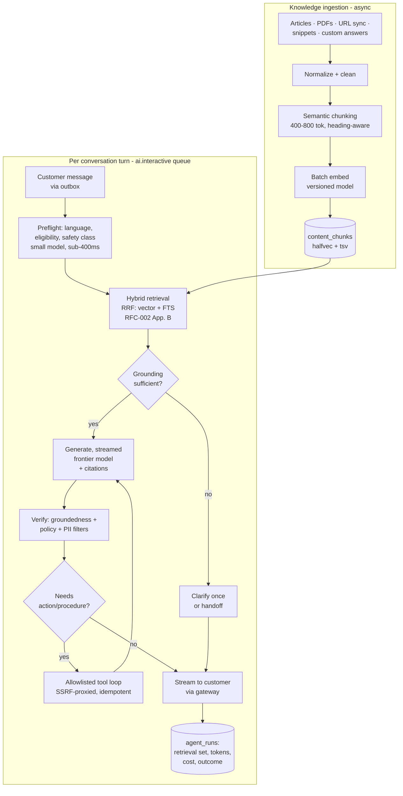

# Relay — AI Agent & Knowledge Subsystem "Aide" (RFC-003)

_Status: Draft · Author: Architecture WG · Date: 2026-07-22_
_One-line summary: The autonomous support agent (Fin-equivalent) and agent-facing Copilot: ingestion → hybrid retrieval → orchestrated generation with guardrails, actions and procedures, a resolution/billing definition, and an eval loop — designed as a worker-tier subsystem, not a separate platform._

Companion docs: RFC-001 (runs in the `ai.*` worker queues; provider resilience posture), RFC-002 (§5.5 owns the storage), RFC-000 (Aide roadmap per phase).

## 1. Context & problem

Aide must (a) resolve a majority of eligible inbound conversations without a human, (b) never dead-end a customer, (c) stay strictly inside each tenant's knowledge and policy boundary, and (d) make money at ≈$0.99/resolution pricing. The engineering problem is less "call an LLM" than: retrieval quality, orchestration under multi-second latencies, tenant isolation, injection-resistant tool use, and **measurement** — you cannot sell a resolution rate you cannot measure.

Treat LLM providers as slow, flaky, expensive, rate-limited dependencies (RFC-001 §9 posture) and design the subsystem so a model outage degrades to "a human answers," never to silence.

## 2. Goals / non-goals

**Goals:** ≥35% resolution on eligible traffic at phase-1 exit, ≥50% at phase-2 (RFC-000 gates); first streamed token p95 < 3 s; per-conversation model cost ≤ $0.05 p90; every answer grounded in tenant sources with citations; all tool side effects idempotent and audited; per-tenant evals runnable before any prompt/model change ships.

**Non-goals (≤ phase 3):** training/fine-tuning custom models (prompted frontier models + retrieval win on iteration speed); voice pipeline internals (phase 3 doc); fully autonomous multi-turn *actions* without an allowlist (never a goal, actually).

## 3. Architecture overview

Aide is **stateless orchestration code in the worker tier** over state in Postgres/Redis — no separate "AI platform" service (RFC-001 §6.1 rationale; the module seam exists if it ever earns independence).

Every turn writes an `agent_runs` row (retrieved chunk ids + scores, prompts hash, model, token counts, cost, outcome, latency breakdown) — the substrate for analytics, billing, debugging, and evals. Nothing about a turn is unreproducible.

## 4. Retrieval quality (where resolution rate actually lives)

- **Ingestion:** normalize to clean text blocks (strip nav/boilerplate on URL sync; OCR fallback for PDFs); heading-aware semantic chunking 400–800 tokens with 10–15% overlap; chunk metadata carries source, locale, audience filters, freshness. Re-sync diffs re-embed only changed chunks.
- **Hybrid retrieval:** pgvector ANN + Postgres FTS fused with reciprocal-rank fusion (query shape in RFC-002 Appendix B); filters: workspace (hard, RLS-backed), locale, audience. Top-40 oversample → optional **rerank** (small cross-encoder-style scoring via cheap LLM) → top 6–10 into context.
- **Custom answers** short-circuit retrieval: admin-curated responses matched by intent similarity (embedding threshold + confirmation margin); they are also the admin's repair tool when generation disappoints.
- **Query understanding:** preflight rewrites the customer message into a search query (conversation-context-aware, multilingual → source-locale). Cheap model, cached.
- **Freshness:** ingestion is outbox-driven (article publish → re-chunk within minutes); retrieval requires `emb_version = current` so re-embed migrations cut over atomically per workspace.

## 5. Orchestration, actions, procedures

- **State machine per turn** (diagram §3): every edge has a timeout and a fallback; total turn budget 20 s hard cap, first token < 3 s p95 (stream directly through Redis pub/sub → gateway; tokens are never stored mid-flight, only the final part).
- **Grounding gate:** if fused retrieval confidence is low → ask **one** clarifying question (tracked; never loops) or hand off. This single gate is the difference between "helpful" and "confidently wrong," and it is tunable per tenant (conservative ↔ eager).
- **Actions** = admin-defined HTTP tools (OpenAPI-ish schema: method, URL template, auth ref, input/output schema, PII flags). Execution: through the SSRF-guard proxy (RFC-001 §10), per-action rate limits, idempotency keys on mutating calls, dry-run test console for admins, response allowlisted into context (schema-validated — a tool response is untrusted input).
- **Procedures** = versioned, declarative multi-step policies ("refund if: order < 30 days AND …") compiled into a constrained plan the orchestrator walks step-by-step — the model fills slots and drafts messages; **the ledger, not the model, owns control flow** (steps recorded like workflow runs, RFC-002 §5.6). This is how multi-step stays auditable and replay-safe.
- **Handoff:** always available ("talk to a person" honored immediately); on handoff Aide posts a private summary note (conversation recap, attempted sources, customer sentiment) so the human starts warm. If workflows route post-handoff, RFC-001 §6.7 takes over.

## 6. Safety & tenant isolation

- **Injection posture:** retrieved content and customer text are data, never instructions — delimited and typed in the prompt; system policy holds instruction hierarchy; tool calls only from the allowlist with schema-validated args; generation must cite retrieved chunk ids, and the verifier rejects claims with no supporting chunk (groundedness check on a cheap model). Red-team suite (injection corpus incl. "ignore previous instructions" families, tool-exfiltration attempts, cross-tenant probes) runs in CI.
- **Isolation:** retrieval queries run under the same RLS + `app.ws` regime as everything else (RFC-002 §7) — the model can never be prompted into another tenant's corpus because the SQL layer cannot return it.
- **Output filters:** PII redaction option per tenant; policy filters (no legal/medical advice beyond sources, configurable); profanity/abuse de-escalation path routes to humans.
- **Kill switches:** per-workspace Aide disable; global model-route flag; per-action disable — all Unleash flags, no deploy needed.

## 7. Copilot (agent-facing) & voice (forward pointer)

Copilot reuses the identical retrieval + `agent_runs` machinery with a different surface: draft suggestions (never auto-send), conversation summarization, tone rewrite, article-from-resolution drafting (closes the knowledge loop: resolved-by-human conversations become suggested articles). Zero additional storage design. Voice (phase 3): streaming ASR → same turn pipeline with partial-utterance handling → streaming TTS; latency budget forces a smaller model tier and aggressive custom-answer matching; separate design doc at phase-3 start.

## 8. Measurement: resolutions, analytics, evals

- **Resolution definition (billing-grade, decided now):** a conversation counts as an Aide resolution iff Aide participated, no human teammate replied after Aide's last answer, the customer confirmed resolution **or** went silent for 72 h after the answer, **and** the conversation was not reopened within 72 h. Reopens claw back the meter (usage_records are appended, corrections are negative rows — never mutated; RFC-002 W8).
- **Analytics (per tenant):** resolution & deflection rate, handoff reasons, CSAT delta (Aide-touched vs not), latency, cost; **content gaps** = unresolved/handoff turns clustered by embedding (HDBSCAN over `agent_runs` embeddings, weekly batch) surfaced as "write an article about X" suggestions — this closes the retrieval-quality flywheel.
- **Evals (the release gate for any prompt/model/retrieval change):**
  - *Golden sets:* per-tenant opt-in sampled transcripts + synthetic sets per vertical; graded by LLM-judge on groundedness/correctness/tone with human spot-audit calibration (κ tracked).
  - *Offline in CI:* retrieval recall@k on labeled corpora; end-to-end judge scores; injection red-team suite; cost/latency regression budgets.
  - *Online:* shadow mode (Aide drafts silently on real traffic, judged offline) before enable per tenant; then A/B vs control cohort; auto-halt flag if resolution or CSAT degrades > X% (symptom alert, RFC-001 §9).
- **Debuggability:** every production answer reconstructs from `agent_runs` (chunks, prompt hash, model, seed where supported) — support can answer "why did it say that?"

## 9. Cost model & unit economics

Per typical resolved conversation (2 Aide turns): preflight ≈1k tok cheap model + retrieval embeds (≈negligible, cached) + generation ≈2×(3k in / 400 out) mid/frontier tier + verification ≈1.5k cheap ⇒ **$0.01–0.05 model cost** at mid-2026 street prices (sensitive assumption; re-price quarterly). At $0.99/resolution ⇒ gross margin > 90% on inference; the real costs are eval infra and re-embeds (bounded, batch, off-peak). Controls: model tiering (cheap for preflight/verify, frontier for generation only), semantic cache per workspace for near-duplicate questions (embedding-similarity keyed, TTL + invalidated on knowledge change), context trimming (only top chunks + rolling conversation summary), per-tenant token budgets + monthly spend caps (429 with human-routing fallback, never silent drop), provider abstraction with per-provider rate-limit pools and failover (RFC-001 §9 table).

At 1.5M Aide conversations/mo envelope: ≈$25–75k/mo inference against ≈$400k+ metered revenue if resolution ≥ 40% — the margin funds the eval discipline that protects it.

## 10. Risks & open questions

| Risk | Mitigation |
|---|---|
| Resolution rate plateaus below sellable bar | Eligibility scoping (start with intents retrieval serves well), custom answers as fast repair, content-gap flywheel (§8), grounding gate tuned conservative |
| LLM-judge grading drifts from human judgment | Quarterly human calibration set; κ threshold gates judge use |
| Provider price/behavior shifts under us | Two-provider abstraction from day one; prompts versioned + eval-gated per provider; cost re-price quarterly (§9 sensitivity) |
| Actions become an exfiltration/abuse vector | Allowlist + schema validation + SSRF proxy + per-action limits + audit; no free-form HTTP ever |
| Semantic cache serves stale/wrong answers post-knowledge-change | Cache keyed on knowledge-version epoch; publish bumps epoch (cheap, coarse, correct) |
| 72 h resolution window disputed by customers | Definition documented in-product + claw-back meters; window per-tenant configurable within bounds |

**Open:** (1) rerank model — cheap-LLM scoring vs hosted cross-encoder; benchmark at phase-1 (owner: AI lead). (2) Embedding model/dimension — 1536-d assumed (RFC-002 §5.5); half-precision benchmark on tenant corpora may allow 768-d and half the index. (3) Judge prompts ownership & versioning process — decide with first eval hire.

---
_This completes the RFC set: 000 scope · 001 system · 002 data · 003 AI._
